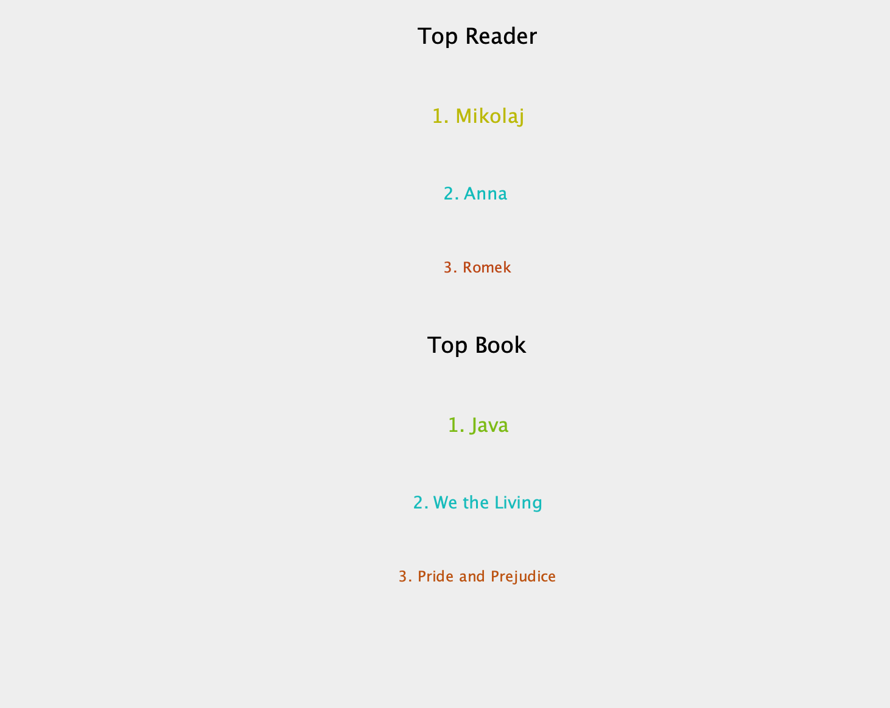

# Library Managment System
> Library Managment system using Swing and JDBC.

## Table of Contents
* [General Info](#general-information)
* [Technologies Used](#technologies-used)
* [Features](#features)
* [Screenshots](#screenshots)
* [Usage](#usage)
* [Project Status](#project-status)
* [Room for Improvement](#room-for-improvement)
* [Contact](#contact)
<!-- * [License](#license) -->

## General Information
- Allows add books 
<!-- You don't have to answer all the questions - just the ones relevant to your project. -->

## Technologies Used
Backend
- Java 8-11
- Swing
- JDBC
- SQL
- SQL
- XML

## Features
List the ready features here:
- Adding books from JSON, XML, CSV
- Export borrowing history to JSON, XML, CSV
- Searching Books
- Readers Ranking
- Books Ranking
- Author's charts

## Screenshots

<!-- If you have screenshots you'd like to share, include them here. -->

## Usage

Credentials:
Login: admin  
password: admin

## Project Status
Project is: complete

## Contact
Created by [@telusmikolaj](https://www.linkedin.com/in/miko%C5%82aj-telus-84aa7122b) - feel free to contact me!

